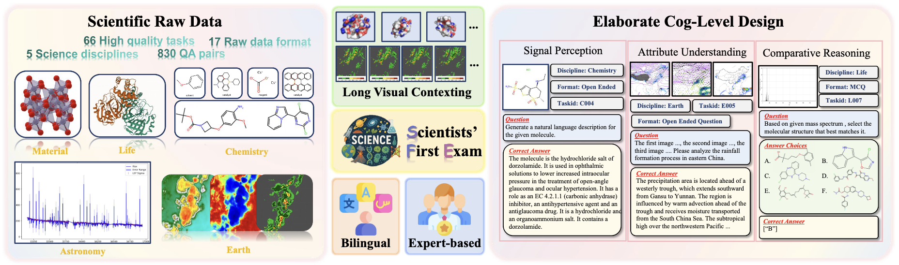
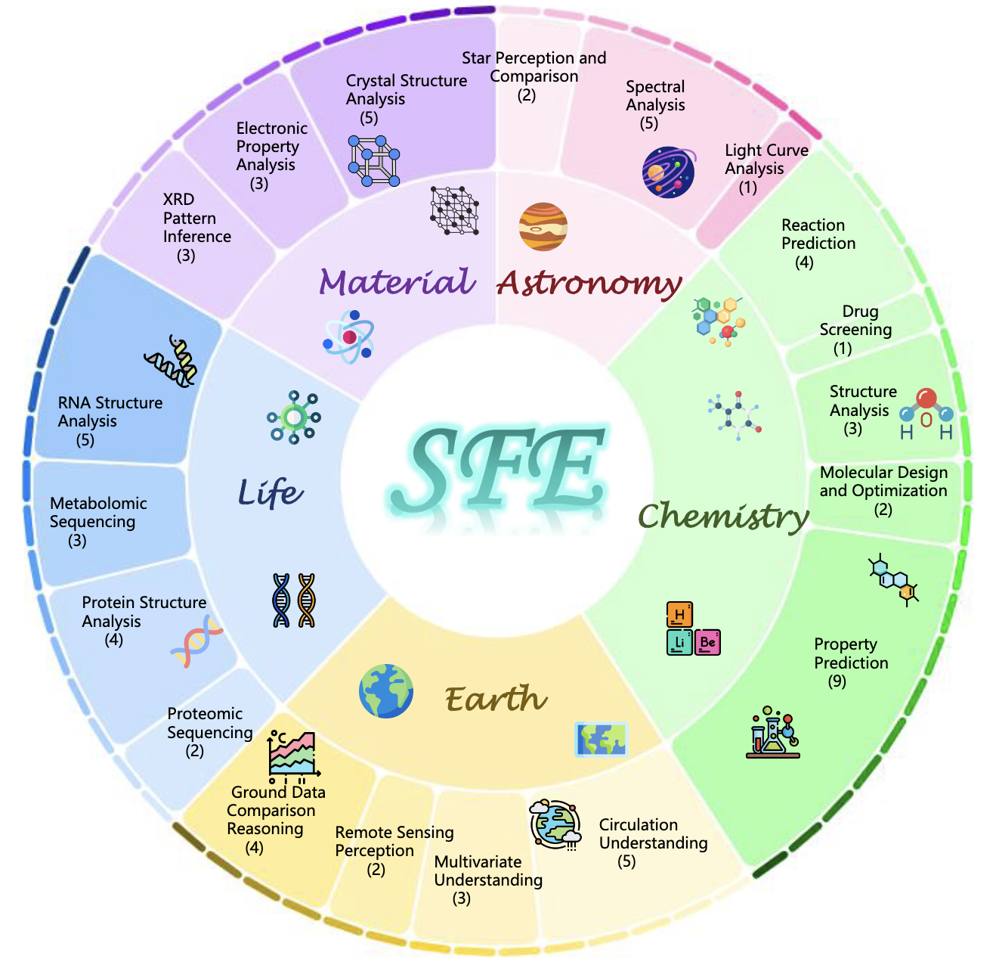

# <center>Scientists' First Exam: Probing Cognitive Abilities of MLLM via Perception, Understanding, and Reasoning</center>

<p align="center">
  <picture>
    <source media="(prefers-color-scheme: dark)" srcset="assets/sfe_title.png">
    
  </picture>
</p>

<p align="center">
| <a href="https://prismax.opencompass.org.cn/leaderboard"><b>Leaderboard</b></a> | <a href="https://arxiv.org/abs/2506.10521"><b>Paper</b> </a> | <a href="https://prismax.opencompass.org.cn/"><b>Website</b> </a> | <a href="https://huggingface.co/datasets/PrismaX/SFE"><b>HuggingFace</b> </a> |
</p>


---

*Latest News* 🔥

[Latest] We are officially integrated by [VLMEvalKit](https://github.com/open-compass/VLMEvalKit). [Intern-S1](https://github.com/InternLM/Intern-S1), the most advanced open-source multimodal reasoning model to date, benchmarked on SFE.

<details>
<summary>Unfold to see more details.</summary>
<be>

- [2025/07] [Intern-S1](https://github.com/InternLM/Intern-S1), the most advanced open-source multimodal reasoning model to date, benchmarked on SFE.
- [2025/07] We are officially integrated by [VLMEvalKit](https://github.com/open-compass/VLMEvalKit).
- [2025/06] We officially released SFE! SFE is designed to evaluate the scientific cognitive capacities of MLLMs through three cognitive levels: **scientific signal perception**, **scientific attribute understanding**, and **scientific comparative reasoning**.

</details>

---

## Motivation: Current scientific benchmarks inadequately assess MLLMs

<details>
<summary>Unfold to see more details.</summary>
<br>
Scientific discoveries increasingly rely on complex multimodal reasoning based on information-intensive scientific data and domain-specific expertise. Empowered by expert-level scientific benchmarks, scientific Multimodal Large Language Models (MLLMs) hold the potential to significantly enhance this discovery process in realistic workflows. However, current scientific benchmarks mostly focus on evaluating the knowledge understanding capabilities of MLLMs, leading to an inadequate assessment of their perception and reasoning abilities. To address this gap, we present the Scientists’ First Exam (SFE) benchmark, designed to evaluate the scientific cognitive capacities of MLLMs through three interconnected levels: **scientific signal perception**, **scientific attribute understanding**, **scientific comparative reasoning**. Specifically, SFE comprises 830 expert-verified VQA pairs across three question types, spanning 66 multimodal tasks across five high-value disciplines. Extensive experiments reveal that current **state-of-the-art** GPT-o3 and InternVL-3 achieve only 34.08% and 26.52% on SFE, highlighting significant room for MLLMs to improve in scientific realms. We hope the insights obtained in SFE will facilitate further developments in AI-enhanced scientific discoveries.

</details>

## Overview

<p align="center">
  
</p>

We introduce the Scientists' First Exam (SFE) benchmark, designed to comprehensively evaluate the scientific cognitive capabilities of MLLMs through three cognitive levels (cog-levels):

1. **Scientific Signal Perception** characterizes the capacity to discern critical components within visualizations of scientific raw data.
2. **Scientific Attribute Understanding** demonstrates the ability to interpret domain-expert knowledge.
3. **Scientific Comparative Reasoning** manifests the ability to derive phenomenological insights through structured comparison of multiple scientific visual sources. 

SFE encompasses 66 expert-curated, high-value multimodal tasks across five disciplines: Astronomy, Chemistry, Earth, Life, and Materials Sciences. 
Each task is constructed from native scientific raw data formats and formulated as visual question answering (VQA) pairs, designed to probe specific levels of scientific cognition. 
All tasks are bilingual (English \& Chinese) to support broad accessibility.
These tasks are designed not only to require a deep understanding of domain-specific knowledge and data analysis skills but also to significantly enhance research efficiency and facilitate advancements that benefit society.

## Download Dataset

 ```bash
git lfs install
git clone https://huggingface.co/datasets/PrismaX/SFE # Clone all files, including raw data
GIT_LFS_SKIP_SMUDGE=1 git clone https://huggingface.co/datasets/PrismaX/SFE # If you want to clone without large files - just their pointers
```

## Evaluations

We use [lmms-eval](https://github.com/EvolvingLMMs-Lab/lmms-eval) for evaluations. Please see [here](./evaluations/README.md) for more details.


## License

SFE is released under the MIT License. See [LICENSE](./LICENSE) for more details.


## Reference

If you find SFE useful in your research, please consider citing the following paper:

```bibtex
@misc{zhou2025scientistsexamprobingcognitive,
      title={Scientists' First Exam: Probing Cognitive Abilities of MLLM via Perception, Understanding, and Reasoning}, 
      author={Yuhao Zhou and Yiheng Wang and Xuming He and Ruoyao Xiao and Zhiwei Li and Qiantai Feng and Zijie Guo and Yuejin Yang and Hao Wu and Wenxuan Huang and Jiaqi Wei and Dan Si and Xiuqi Yao and Jia Bu and Haiwen Huang and Tianfan Fu and Shixiang Tang and Ben Fei and Dongzhan Zhou and Fenghua Ling and Yan Lu and Siqi Sun and Chenhui Li and Guanjie Zheng and Jiancheng Lv and Wenlong Zhang and Lei Bai},
      year={2025},
      eprint={2506.10521},
      archivePrefix={arXiv},
      primaryClass={cs.AI},
      url={https://arxiv.org/abs/2506.10521}, 
}
```
